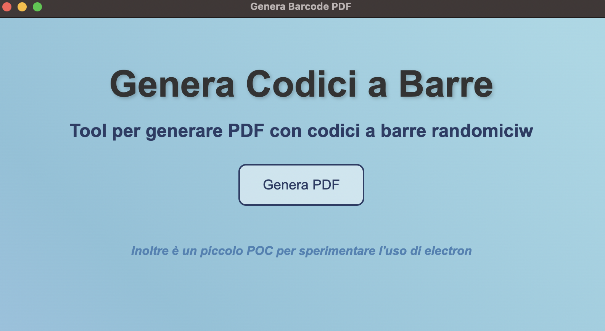

# Generatore di Codici a Barre



Questo è un semplice generatore di codici a barre che crea un PDF con 40 codici a barre randomici. Il progetto è stato sviluppato per facilitare la generazione di codici a barre per vari scopi, come l'etichettatura di prodotti o la gestione dell'inventario. Stiamo anche sperimentando la creazione di un'app Electron per migliorare l'esperienza utente.

## Requisiti

- **Node.js** (versione 14 o successiva)
- **npm** (o **yarn** come alternativa)

## Installazione

1. Clona il repository:
    ```bash
    git clone https://github.com/Antonio-Russo/barcode-pdf.git
    cd barcode-generator
    ```

2. Installa le dipendenze:
    ```bash
    npm install
    ```

## Lanciarlo in locale

Per avviare il generatore di codici a barre in locale, esegui il comando:
```bash
npm start
```

## Build multipiattaforma

Per creare una build multipiattaforma, segui questi passaggi. Nota che se desideri generare una build per Windows, non puoi farlo da un sistema operativo macOS.

1. Installa le dipendenze:
    ```bash
    npm install
    ```

2. Installa gli strumenti di build per Windows:
    ```bash
    npm install --global windows-build-tools
    ```

3. Genera la build:
    ```bash
    npm run build
    ```

## Contribuire

Se desideri contribuire al progetto, sentiti libero di aprire una pull request o segnalare un problema nel repository GitHub.

## Licenza

Questo progetto è distribuito sotto la licenza MIT. 


